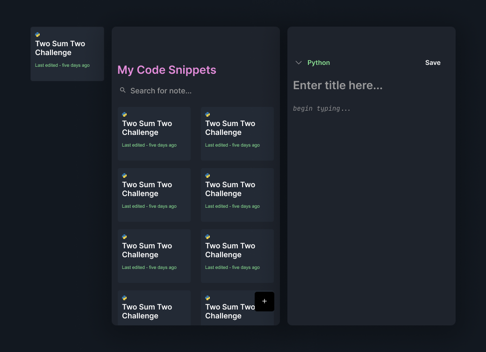

# CodeCookies: A React Expo Project

## Abstract

In this project I want to build a fully functional React Native app. I had quite a bit of experience with Flutter but, with my recent exploration of React.js and my familiarity with javascript, I felt it was only right to start building into React Native. 

I am starting off slow with a simple notes app; My twist though is that this app actually takes notes as a code editor. Small code snippets.

For this project I want to familiarize myself with the Expo CLI and React Native design. I also want to get more comfortable using Redux.js to store data. 

### UI Design

For my design I wanted something that reminded me of a code editor but still minimalist. This is because these are just “snippets”. It’s not a full editor but lightweight. Therefore, the design choices reflect this lightweight concept.